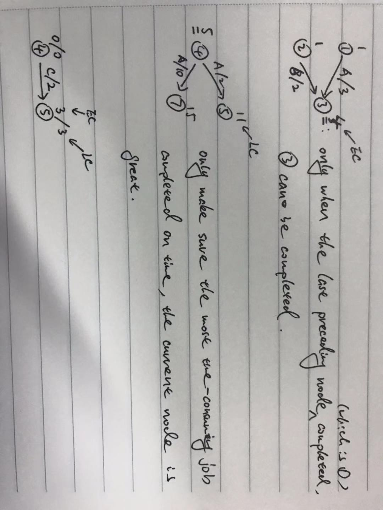

## Graph

### DFS

```js
    function DFS(adj, start) {
        let visited = {};

        let dfs = v => {
            visited[v] = true;
            for (let w in adj[v]) {
                if (!visited[w]) {
                    dfs(w);
                }
            }           
        }

        dfs(start);
    }
```

DFS can be used in many ways. And in the most scenarios, **visited map** should be restored for next usage, e.g.

```js
    for (...) {
        visited.push(v);
        dfs(w, ...)
        visited.pop();
    }
```

### BFS

**simple implementation:**

```js
    // can not work in a graph with circular
    function BFS(adj, start) {
        let queue = new Queue;
        
        let bfs = () => {
            if (!queue.isEmpty()) {
                let v = queue.dequeue();
                for (let w in adj[v]) {
                    if (w not in queue) {
                        queue.enqueue(w);
                    }
                }
            }
        }

        queue.enqueue(start);
        bfs();
    }
```

**level order traversal with only one queue:**

if we only have on queue, how to distinguish where is the end of last level? Cause we keep enqueue nodes, they will merge with previous nodes. 

if we have two queues, one is for current nodes, one is for next nodes, when current queue is empty, `curQueue = nextQueue`

with one queue, there are two ways:

1. counting number of current nodes and next nodes, `curB` and `nextB`, respectively. when we dequeue a current node, `curB--`. when curB === 0, we know current nodes had all visited.

2. store node with its level. e.g. `<node1, 1>`, `<node2, 4>`

example:

1. `#127. Word Ladder, in leetcode`

**bidirectional BFS**

if we know the end node that we need find, then we can start from **begin node** and **end node** parallelly. In every turn(level), if found nodes from begin node has same nodes in nodes from end node, then we found a path from begin node to end node.

steps:

1. prepare two queues, one for begin node, one for end node
2. in every turn, find next level of begin node and end node
3. then check if there are any node both in next level of begin node and end node
    1. if has, stop the loop
    2. if not, start next level
4. if one of queue is empty, stop loop and return not found a path between begin node and end node

### top sorting

always find a vertex with **zero-indegree**. if has not and there are still **unvisited** vertexes, this graph has **circle**

### single source shortest path(sssp)

- undigraph is just like digraph in this problem, just has double edges, but the processes are the same
- unweighted
    - `BFS` is enough, observe that if reaching one vertex already, then the dist of it is the smallest, cause it's unweighted, reaching it later is at least 1 larger than it

        T(n) = O(|V| + |E|)
    - if it's undigraph, we can use `bidirectional BFS` to find the smallest path from one vertex to another specific vertex. 
    - if the graph has circulars, must use `known` tag or  **count visited vertexes**(BFS only visited every vertex once) to avoid infinite loop
- weighted
    - `dijstra` for graph with **non-neg** edges, it's working when graph has circulars

        
    - for graph with **non-neg** edges, the **known** vertex may still have chance to update it's **dist** when it has a **neg** edge connected it. instead of using `known` tag, using a queue to store vertexes will visit, and always update vertexes adjacent to vertex in the queue when got smaller dist. Stop when queue is empty. **It's not working in graph has circulars**
- summary
    - `known` tag and `count visited vertexes` to nail **graph with circular**
    - `known` tag can not be used in **graph with neg edges**
    - algorithms for weighted graph can also work in undigraph

dijstra:

1. keys
    1. finding the smallest unknown path to next vertex(**notice that it's the vertex has a non-infinity dist**) in every step.
    2. updating the dist and path of one vertex when a new vertex is known and is adjacent to it
    3. why a known vertex can not be updated(it can not be put in the queue)?

        Because a known vertex must be the smallest path from the start node to itself, so if there're any update can make it smaller, it's a **paradox**
    4. using a priority queue(min heap) to store the vertexes, which decrease find min operation(**O(|V|)**) to **O(log|V|)**
2. steps
    1. put start node into queue
    2. create a table `T` to store info(path, dist, known) of every vertex 
    3. if queue is not empty, repeat the following:
        1. tag the vertex **known**
        2. find the smallest vertex `v` in the queue, pop it
        3. for each every vertex `w` adjacent to `v`:
            a. if it gets smaller dist, updating its info in the `T`
            b. push it in the queue 
    4. stop the entire loop when queue is empty
    5. we can find all the paths starting from the start vertex to any other vertex in the graph by parsing `path` in `T`
3. T(n) = O(|V|^2 + |E|), extra O(|V|) for **find shortest unknown vertex**

A-star(*):

1. key
    1. f(x) = g(x) + h(x), x is label of a vertex.
        1. f is a value represents the possiblity that the vertex is in the cheapest path from start node to the dist node.
        2. g is the cost walking from start vertex to x
        3. h is a heuristic function to **estimate** the cost walking from x to the dist vertex. 
        
            And it is the key to calcuate f. h can be any strategy, but make sure it's monotonous => h(x) <= h(x') + d(x', x), x' is the vertex before x in the smallest cost path
    2. **open list** and **closed list**
    3. when to update f of a vertex
    4. when to stop the entire loop

### Critical paths (Graph without circular):

- earliest complete time (EC)

    EC is the earliest time reaching a node, it's related to preceding nodes. Only the last preceding node completed, current node can be reached.

    fomula:

    EC0 = 0,
    ECw = max(ECv + c(v, w)), v precedes w

- latest complete time (LC)

    LC is the latest time that will not afect completion of nodes after, it's related to nodes after. Thinking of having a node which has more than one node after:

    LCn = ECn,
    LCv = min(LCw, c(v, w)), v preceds w

- slack time (S)

    notice that EC and LC describe the nodes, which is start or end of one **event(action)**, slack time **describes a event**. An event is a edge in the graph.

    slack time means how much an event can be delayed but not affects the prcessing after it, which is related with its start node and end node. if an event starts as ealier as possible (which is EC of start node), and when it ends before it should be completed latest(which is LC of end node), then this event's slack time > 0.

    fomula:

    Sa = LCw - ECv - c(v, w), v, w are start and end node of event `a`, respectively, v preceds w



the critical path is a simple path that slack time of every edge in the graph is 0, which means if any node in this path delays, the entire task can not be completed on time

### undigraph part:

#### largest networking flow

1. concepts
    - `augmenting path`, it is a simple path between start and end
    - `flow graph`, the current status of the graph that how much flux has flowed through the graph. 

        at begining, flow graph is a copy of the original one but the edges are all 0
    - `residual graph`, the remain of flux in the graph that can be used for other augmenting path

        at begining, residual graph is a copy of the original one
2. steps
    1. pick randomly a augmenting path in residual graph, then minus the edges used in residual graph, and add them in the flow graph
    2. keep doing `1`, until there are no augmenting path in the residual
3. defect

    cause picking a augmenting path randomly, it may pick a path which will exhaust the path can be used in other paths, and that could avoid if pick another one. 
4. improve
    
    if we used some flows of a edge, create a new reverse edge with this used flows.

#### minimum spanning tree

1. feature
    1. has `|V| - 1` edges
    2. has no circual cause it's a tree
    3. greediness
2. algorithm
    1. prim
        1. like dijstra, find the min dist (u, w), that u is in the set of current tree, and v is not. This rule makes sure there are never create a circular
        2. using minHeap will be more efficient to find the min edge
        3. T(n) = 
            - O(|V|^2) without heap
            - O(|E|*log|V|) ??
    2. kruskal
        1. find the min dist (u, w) in the whold graph, only accepts edges will not create circular
        2. using union set to check if accepts or not, aka the two vertexes of a edge are in the same set or not, O(log|V|)

#### find the cut points in undigraph

#### Eular Circular

### Problem summary

Eular path

- `#332 in leetcode`

DFS

- `#399 in leetcode`
- `#332 in leetcode`

