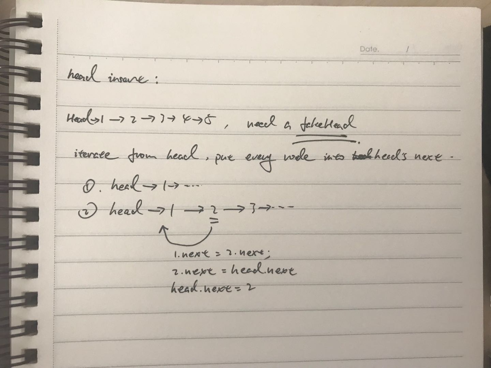
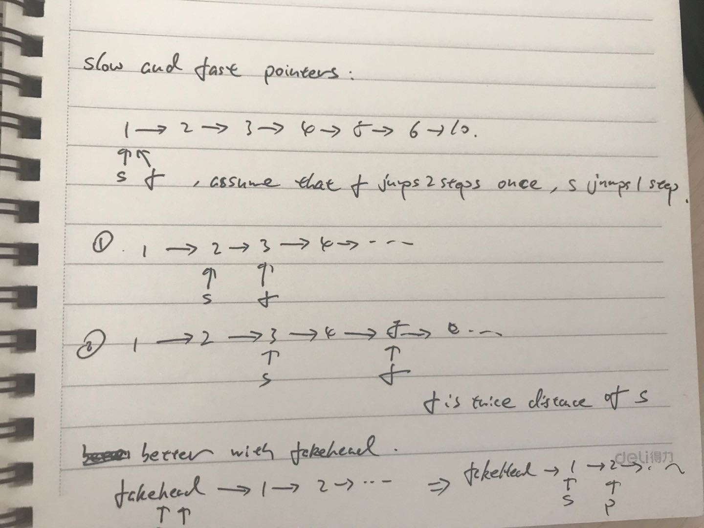

# Linked List

type:

1. single linked list
    1. one node only has one pointer, point the next node in the list
2. double linked list
    1. one node has two pointer, one points its successor, one points its precursor
3. circular linked list
    1. the last node's `next pointer` points the head node, rather than `null`
    2. need store the tail node

ops & T(n) and S(n):

- insert
    1. `head insert`, O(1)
    2. `tail insert`, O(n), but consecutively insert m data will cost O(mn + n^2/2)
    3. insert into right place, O(n)
- delete
    1. O(1), but extra find op will cost O(n) at worst
- find
    1. O(n) at worst

pros and cons:

1. comparing with array:
    1. O(1) for inserting and deleting, array will cost O(n)
    2. no need consecutive memory, but one pointer takes more space
    3. find op costs O(n) at worst, array can be O(1)
2. double linked list is convenient for accessing one node's parent
3. circular linked list is convenient for circular iterating

tricks & questions:

1. `head insert`
    1. reverse a list, e.g.
        
        
2. `fake head`

    if a list does not has a head, we can fake it by `fakeHead.next = firstnode`

    1. convenient for iterating next of the list, e.g. 1 -> 2 -> 3
        1. without head
        
            ```js
            // head is the first node
            if (!head) {
                return;
            }
            let cur = head;
            while (cur.next != null) {
                let next = cur.next;
                // ...
                cur = next;
            }
            ```
        2. with head
        
            ```js
            let fakeHead = new Node(null);
            fakeHead = head;
            let cur = fakeHead;
            while (cur.next != null) {
                let next = cur.next;
                // ...
                cur = next;
            } 
            ```
    2. need store **pre node**, without head will be hard to handle the first iterate 
3. `slow and fast pointer`

    

    Q: get **Nth** node from tail is the same, using two pointer move with interval


usage scenario:

1. LRU (latest recent usage)
    1. every time find a node and find it, delete it and insert it from head
