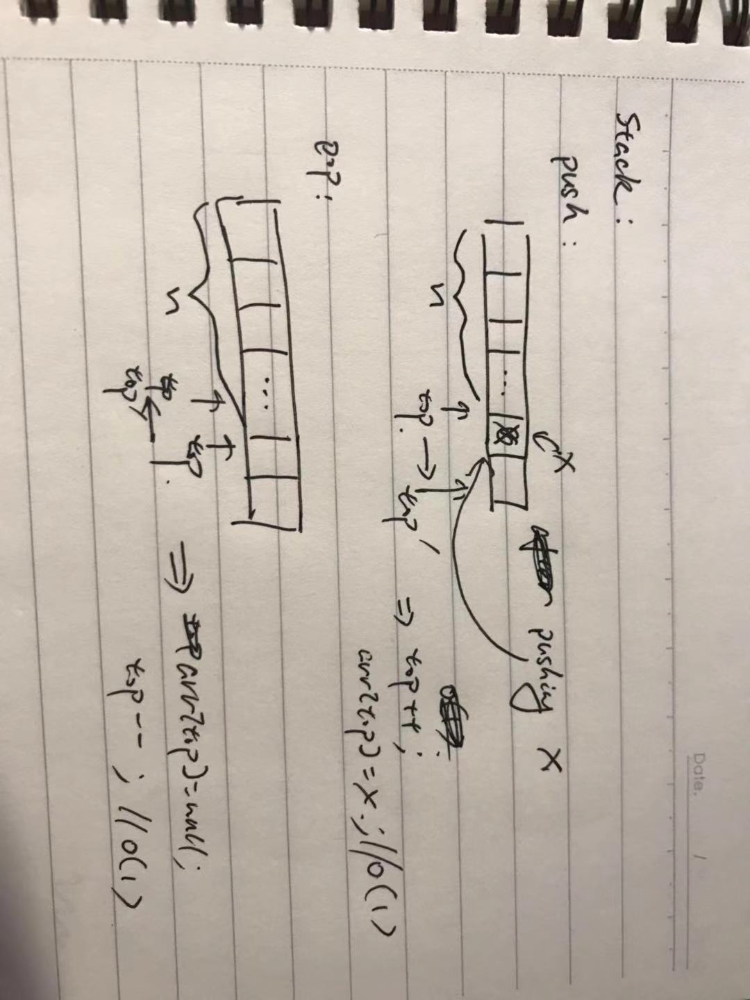

# Review

## Data structure

#### Array

array is very easy and basic data structure, many higher data structures are based on it. I guess because it's basic, so there are too many problems those can be easy, median and hard! 

notice:

- **handle boundary**. handle boundary is a very common op in array
    - `0 < i < length`
    - if i from 1, then `i <= length`
    - len between two indexes (i, j),  `j - i + 1`
    - circular: `i % len`
    - 

tricks:

- slide window, or it's called left & right collision pointers, cause it has two pointers i, j, between them is the window
- sorted and skip to remove duplicates
- dp
- using index of array as hashmap, `#41 in leetcode`
- swap between interval `#80 in leetcode`

    it's like we want remove a num but you know, remove a num is expensive(O(n) at worst). the first thought is swap it with end of array, but sometime you also need adjust after swapping, just like in `#80`

    the interval is like when we have a num need to remove, we make interval = 1, then when we iterate next num, swap it with its (index - 1), .e.g.

    1,2,3,4,5  we want remove 3, let's simulate the process

    1. iterate to i = 2, nums[i] is 3, we know it should be delete
    2. set interval = 1, tmp = 3, and just move forward
    3. i = 3, set nums[i - interval] = nums[i], nums[i] = tmp
    4. when the iterating is over, we find 3 is in the end

#### Stack 

first in last out(FILO). 

op:

1. push. O(1)
2. pop. O(1)



usage scenario:

1. arithmetic expression calculation
    - infix => postfix
    - check symbol pairs(like bracket)
2. function call
3. non-recursionly implementation

#### Queue

FIFO(first in first out)

usage scenario:

1. tree level order traversal
2. tasks followed FIFO
3. BFS

#### Hashtable

1. problems
    - what is hash function
    - how to design a good hash function
    - what is a collision
    - how to solve collision
    - types
    - op & T
2. concepts
    - `load factor`: nums of elements / length of table

hash function:

it is a function that input is a string, and output is a number. A good hash function should have:

1. Efficient, calculate quickly
2. Distribute evenly, which makes less conflicts

e.g. ['sdsd', 'asdds', 'sdffee', 'dsdsd'], by using some hash function, we can have hash values: [3, 5, 4, 3]. As we see, the first one and last one are conflicting, so how to solve this collision?

1. just recalcuate a new number which not equals any of hash value existed.
2. using **linked list** to store all the conflict values

resolve conflict function:

1. separate chaning 
    
    using linked list to store conflict elements, hash(X) = x mod `length of table`

    find:

    T(n)best = O(1) => calc hash(O(1)) + get it(O(1))
    T(n)worst = O(n), imagine that all the elements in the same linked list
    T(n)even = O(1)

    insert:

    just like `find`
2. opening adressing
    1. linear probing, F(i) = i
    2. square probing, F(i) = i^2 
    3. double hash, F(i) = i * hash2(X)
    4. rehashing, double the size of table, which need rehash the elements(cause size of table changed) in the table and copy them into new table

#### Tree

`./tree.md`

#### Tries

#### Priority Queue

#### Binary search

1. implementation smoothly

    ```js
        function bs(arr) {
            let low = 0;
            let high = arr.length - 1;
            while (low <= high) {
                let mid = Math.floor((low + high) / 2);
                if (...) { // in some condition, move forward to right part
                    low = mid + 1;
                }
                if (...) {// in some condition, move forward to left part
                    high = mid - 1
                } 
            }
        }
    ```
2. understant boundary

## Math

#### Discrete Match

## System Design

#### data take bytes?

to evaluate the size of data, using `byte` as unit

- pointer
    - 4, in 32bit machine, 4 = 32 / 8
    - 8, in 64bit
- int
    - 4
- char
    - 

#### Caching
#### Load balance
#### NOSQL
#### MapReduce

## Other

#### bitwise operation

trick formula:

usage:

1. swap int

fomula: a^b^a = b

```js
function swap(a: int, b: int): {a: int, b: int} {
    a ^= b;
    b ^= a;
    a ^= b;

    return { a, b }
}
```