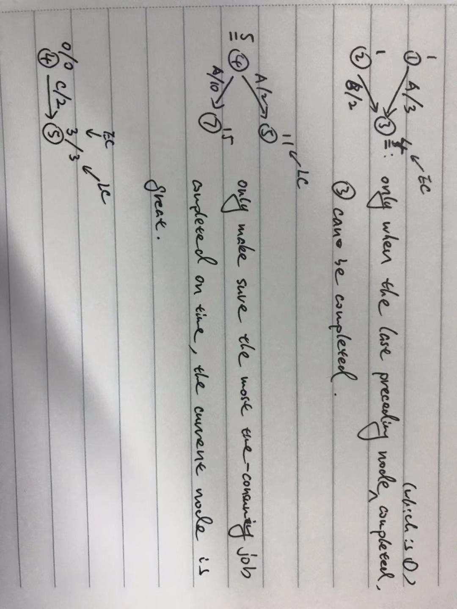

# Review

## Data structure

#### Array

array is very easy and basic data structure, many higher data structures are based on it. I guess because it's basic, so there are too many problems those can be easy, median and hard! 

notice:

- **handle boundary**. handle boundary is a very common op in array
    - `0 < i < length`
    - if i from 1, then `i <= length`
    - len between two indexes (i, j),  `j - i + 1`
    - circular: `i % len`
    - 

tricks:

- slide window, or it's called left & right collision pointers, cause it has two pointers i, j, between them is the window
- sorted and skip to remove duplicates
- dp
- using index of array as hashmap, `#41 in leetcode`
- swap between interval `#80 in leetcode`

    it's like we want remove a num but you know, remove a num is expensive(O(n) at worst). the first thought is swap it with end of array, but sometime you also need adjust after swapping, just like in `#80`

    the interval is like when we have a num need to remove, we make interval = 1, then when we iterate next num, swap it with its (index - 1), .e.g.

    1,2,3,4,5  we want remove 3, let's simulate the process

    1. iterate to i = 2, nums[i] is 3, we know it should be delete
    2. set interval = 1, tmp = 3, and just move forward
    3. i = 3, set nums[i - interval] = nums[i], nums[i] = tmp
    4. when the iterating is over, we find 3 is in the end

#### Stack 

first in last out(FILO). 

op:

1. push. O(1)
2. pop. O(1)


usage scenario:

1. arithmetic expression calculation
    - infix => postfix
    - check symbol pairs(like bracket)
2. function call
3. non-recursionly implementation

#### Queue

FIFO(first in first out)

usage scenario:

1. tree level order traversal
2. tasks followed FIFO
3. BFS

#### Hashtable

1. problems
    - what is hash function
    - how to design a good hash function
    - what is a collision
    - how to solve collision
    - types
    - op & T
2. concepts
    - `load factor`: nums of elements / length of table

hash function:

it is a function that input is a string, and output is a number. A good hash function should have:

1. Efficient, calculate quickly
2. Distribute evenly, which makes less conflicts

e.g. ['sdsd', 'asdds', 'sdffee', 'dsdsd'], by using some hash function, we can have hash values: [3, 5, 4, 3]. As we see, the first one and last one are conflicting, so how to solve this collision?

1. just recalcuate a new number which not equals any of hash value existed.
2. using **linked list** to store all the conflict values

resolve conflict function:

1. separate chaning 
    
    using linked list to store conflict elements, hash(X) = x mod `length of table`

    find:

    T(n)best = O(1) => calc hash(O(1)) + get it(O(1))
    T(n)worst = O(n), imagine that all the elements in the same linked list
    T(n)even = O(1)

    insert:

    just like `find`
2. opening adressing
    1. linear probing, F(i) = i
    2. square probing, F(i) = i^2 
    3. double hash, F(i) = i * hash2(X)
    4. rehashing, double the size of table, which need rehash the elements(cause size of table changed) in the table and copy them into new table

#### Tree

`./tree.md`

#### Tries

#### Priority Queue
#### Graph

top sorting:

single source shortest path(sssp):

- undigraph is just like digraph in this problem, just has double edges, but the processes are the same
- unweighted
    - `BFS` is enough, observe that if reaching one vertex already, then the dist of it is the smallest, cause it's unweighted, reaching it later is at least 1 larger than it

        T(n) = O(|V| + |E|)
    - if it's undigraph, we can use `bidirectional BFS` to find the smallest path from one vertex to another specific vertex. 
    - if the graph has circulars, must use `known` tag or  **count visited vertexes**(BFS only visited every vertex once) to avoid infinite loop
- weighted
    - `dijstra` for graph with **non-neg** edges, it's working when graph has circulars

        
    - for graph with **non-neg** edges, the **known** vertex may still have chance to update it's **dist** when it has a **neg** edge connected it. instead of using `known` tag, using a queue to store vertexes will visit, and always update vertexes adjacent to vertex in the queue when got smaller dist. Stop when queue is empty. **It's not working in graph has circulars**
- summary
    - `known` tag and `count visited vertexes` to nail **graph with circular**
    - `known` tag can not be used in **graph with neg edges**
    - algorithms for weighted graph can also work in undigraph

dijstra:

1. keys
    1. finding the smallest unknown path to next vertex(**notice that it's the vertex has a non-infinity dist**) in every step.
    2. updating the dist and path of one vertex when a new vertex is known and is adjacent to it
    3. why a known vertex can not be updated(it can not be put in the queue)?

        Because a known vertex must be the smallest path from the start node to itself, so if there're any update can make it smaller, it's a **paradox**
    4. using a priority queue(min heap) to store the vertexes, which decrease find min operation(**O(|V|)**) to **O(log|V|)**
2. steps
    1. put start node into queue
    2. create a table `T` to store info(path, dist, known) of every vertex 
    3. if queue is not empty, repeat the following:
        1. tag the vertex **known**
        2. find the smallest vertex `v` in the queue, pop it
        3. for each every vertex `w` adjacent to `v`:
            a. if it gets smaller dist, updating its info in the `T`
            b. push it in the queue 
    4. stop the entire loop when queue is empty
    5. we can find all the paths starting from the start vertex to any other vertex in the graph by parsing `path` in `T`
3. T(n) = O(|V|^2 + |E|), extra O(|V|) for **find shortest unknown vertex**

A-star(*):

1. key
    1. f(x) = g(x) + h(x), x is label of a vertex.
        1. f is a value represents the possiblity that the vertex is in the cheapest path from start node to the dist node.
        2. g is the cost walking from start vertex to x
        3. h is a heuristic function to **estimate** the cost walking from x to the dist vertex. 
        
            And it is the key to calcuate f. h can be any strategy, but make sure it's monotonous => h(x) <= h(x') + d(x', x), x' is the vertex before x in the smallest cost path
    2. **open list** and **closed list**
    3. when to update f of a vertex
    4. when to stop the entire loop

Critical paths (Graph without circular):

- earliest complete time (EC)

    EC is the earliest time reaching a node, it's related to preceding nodes. Only the last preceding node completed, current node can be reached.

    fomula:

    EC0 = 0,
    ECw = max(ECv + c(v, w)), v precedes w

- latest complete time (LC)

    LC is the latest time that will not afect completion of nodes after, it's related to nodes after. Thinking of having a node which has more than one node after:

    LCn = ECn,
    LCv = min(LCw, c(v, w)), v preceds w

- slack time (S)

    notice that EC and LC describe the nodes, which is start or end of one **event(action)**, slack time **describes a event**. An event is a edge in the graph.

    slack time means how much an event can be delayed but not affects the prcessing after it, which is related with its start node and end node. if an event starts as ealier as possible (which is EC of start node), and when it ends before it should be completed latest(which is LC of end node), then this event's slack time > 0.

    fomula:

    Sa = LCw - ECv - c(v, w), v, w are start and end node of event `a`, respectively, v preceds w



the critical path is a simple path that slack time of every edge in the graph is 0, which means if any node in this path delays, the entire task can not be completed on time

DFS:

```js
    function DFS(adj, start) {
        let visited = {};

        let dfs = v => {
            visited[v] = true;
            for (let w in adj[v]) {
                if (!visited[w]) {
                    dfs(w);
                }
            }           
        }

        dfs(start);
    }
```

BFS:

```js
    // can not work in a graph with circular
    function BFS(adj, start) {
        let queue = new Queue;
        
        let bfs = () => {
            if (!queue.isEmpty()) {
                let v = queue.dequeue();
                for (let w in adj[v]) {
                    if (w not in queue) {
                        queue.enqueue(w);
                    }
                }
            }
        }

        queue.enqueue(start);
        bfs();
    }
```

undigraph part:

largest networking flow

1. concepts
    - `augmenting path`, it is a simple path between start and end
    - `flow graph`, the current status of the graph that how much flux has flowed through the graph. 

        at begining, flow graph is a copy of the original one but the edges are all 0
    - `residual graph`, the remain of flux in the graph that can be used for other augmenting path

        at begining, residual graph is a copy of the original one
2. steps
    1. pick randomly a augmenting path in residual graph, then minus the edges used in residual graph, and add them in the flow graph
    2. keep doing `1`, until there are no augmenting path in the residual
3. defect

    cause picking a augmenting path randomly, it may pick a path which will exhaust the path can be used in other paths, and that could avoid if pick another one. 
4. improve
    
    if we used some flows of a edge, create a new reverse edge with this used flows.

minimum spanning tree

1. feature
    1. has `|V| - 1` edges
    2. has no circual cause it's a tree
    3. greediness
2. algorithm
    1. prim
        1. like dijstra, find the min dist (u, w), that u is in the set of current tree, and v is not. This rule makes sure there are never create a circular
        2. using minHeap will be more efficient to find the min edge
        3. T(n) = 
            - O(|V|^2) without heap
            - O(|E|*log|V|) ??
    2. kruskal
        1. find the min dist (u, w) in the whold graph, only accepts edges will not create circular
        2. using union set to check if accepts or not, aka the two vertexes of a edge are in the same set or not, O(log|V|)

find the cut points in undigraph

Eular Circular

#### Union set

## Algorithm

#### Sorting

1. insertion
    
    in every turn `i`, [0, i - 1] of arr is sorted, just puting arr[i] into the right place of its left area.

    belong to **exchange sort**

    - T(n)
        - worst, O(n^2), when the arr is reverse order
        - best, O(n), when the arr is sorted
        - average, O(n^2)
    - S(n) = O(1)
    - code

        ```js
        function insertion(arr) {
            let n = arr.length;
            if (n < 2) {
                return arr;
            }
            
            for (let i = 1; i < n; i++) {
                let tmp = arr[i];
                let j = i;
                while (arr[j - 1] > tmp && j > 0) {
                    arr[j] = arr[j - 1];
                    j--;
                }
                arr[j] = tmp;
            } 

            return arr;
        } 
        ```
2. shell
    
    also called augmenting sort. It has a importatn concept called `increment sequence`. assume h is a num of interval between two nums in the arr, so with `h` we can have a sequence of nums. 
    
    In every turn, we sort this sequence, until h = 1, means all the nums in one sequence, and sort them all.

    shell is also belong to **exchange sort**
    
3. quick

    also a **divide and conquar** algorithm. 
    
    the key is `pivot`, we chiose a pivot, and put the nums **in its left larger than it** into its right, and put the nums **in its right smaller than it** into its left.

    key steps:

       - get **median**. sort the left, right, and middle nums, then swap the middle num with the num in pos `right - 1`, which is **hiding the pivot**. After the sort process, we need to **restore the pivot**: `swap(right - 1, i)`, i is the left pointer
       - in one sort, the left pointer has boundary to right, which is the pivot itself, and right pointer's boundary is `left`

        ```js
        let i = left; 
        let j = right - 1; 
        while (true) {
            while (arr[++i] < pivot) {} // notice that at first time, i is not the pos first num stand, i + 1 is, so it's ++i, j is the same
            while (arr[--j] > pivot) {} 
            if (i < j) {
                swap(i, j, arr);
            }
            else {
                break;
            }
        }
        ```

    T & S:
    
    S(n) = O(1)
    T(n) = T(i) + T(n - i - 1) + cN, i is the num of left part of arr
    T(n)best = O(nlogn), when pivot always in the middle after one sort => T(n) = 2T(n/2) + cn
    T(n)worst = O(n^2)
    T(n)average = O(nlogn)
4. merge

    merge sort is a **divide and conquar** algorithm. in every turn, it merges two part in this arr, and the part will split into two smaller parts, until its only one element. 

    - `merge once`. 
    
      function sign: `mergeOnce(low, mid, high, tmp)`. 
      
      - mid is `(low + high) / 2`, cause we calc it outside, so no need to calc it again. 
      - tmp is an array to store merged result in one merge, it can be used cyclically, cause it's only one merge running at the same time.

    - `merge`. divide and Conquar funciton

        ```js
        function mergeSort(low, high, tmp) {
            if (low < high) {
                let mid = ...
                mergeSort(low, mid, tmp);
                mergeSort(mid, high, tmp);
                mergeOnce(low, mid, high, tmp);
            }
        }
        ```

        T(n) = 2T(n/2) + O(n) => T(n) = O(nlogn)
5. heap sort

    it's easy if already implemented heap. It's just two step:
    
    1. build heap O(n)
    2. delete min to result array n*O(logn)

    but this way has O(n) extra space, if wants in-place, here is a train of thought:

    build heap is the same. when **delete min**, instead of poping the last elem, put it into the last pos of arr, which is not using any more. 

    keep doing that, when all the elems deleted, the arr will be sorted. (**min heap will become a descend ordered array**)

tricks:

1. sort linked list
    
    merge sort in linked list, using slow and fast pointers to get middle.
    So divide and conquar can be used in linked list

2. sort with swap

    we know that the fastest normal sort is O(nlogn), but with swapping in special situations, it can be O(n). e.g. `#75 leetcode`


#### Combinatorics&Possibilties

A(n, m) represents permutation num,  how many permutations when pick non-repeatedly `m` nums from a set with `n` nums.

A(n, m) = n * (n - 1) * (n - 2) * ... * (n - m + 1) = n! / (n - m)!

C(n, m) represents combination num, how many ways to pick non-repeatedly `m` nums from a set with `n` nums. C(n, m) is a subset in A(n, m), because C(n, m) treats all the permutations with same num sequence as 1.

C(n, m) = A(n, m) / m!

how to create permutations:

1. A(n, n):

```js
    function getPermutations(nums) {
        let p = [];
        let bt = (remain, curP) => {
            if (remain.length === 0) {
                p.push([...curP]);
                return;
            }

            for (let i = 0; i < remain.length; i++) {
                let pop = remain.splice(i, 1)[0];
                curP.push(pop);
                bt(remain, curP);
                remain.splice(i, 0, pop);
                curP.pop();
            }
        }
        bt(nums, []);

        return p;
    }
```

2. C(n, m):

```js
    /**
     * bactracing
     * T(n) = O(n!)
     * S(n) = O(n)
     * @param {number} n
     * @param {number} k
     * @return {number[][]}
     */
    function combine(n, k) {
        let ans = [];
        if (k > n) {
            return ans
        }

        let bt = (i, combinations) => {
            combinations.push(i);
            if (combinations.length === k) {
                ans.push([...combinations])
                combinations.pop();
                return;
            }

            for (let j = i + 1; j <= n; j++) {
                bt(j, combinations);
            }
            combinations.pop();
        }
        let tmp = []; // s = O(n);
        for (let i = 1; i <= n - k + 1; i++) {
            bt(i, tmp);
        }

        return ans;
    }
```

#### Binary search

1. implementation smoothly

    ```js
        function bs(arr) {
            let low = 0;
            let high = arr.length - 1;
            while (low <= high) {
                let mid = Math.floor((low + high) / 2);
                if (...) { // in some condition, move forward to right part
                    low = mid + 1;
                }
                if (...) {// in some condition, move forward to left part
                    high = mid - 1
                } 
            }
        }
    ```
2. understant boundary

## Math

#### Discrete Match

## System Design

#### data take bytes?

to evaluate the size of data, using `byte` as unit

- pointer
    - 4, in 32bit machine, 4 = 32 / 8
    - 8, in 64bit
- int
    - 4
- char
    - 

#### Caching
#### Load balance
#### NOSQL
#### MapReduce

## Other

#### bitwise operation

trick formula:

usage:

1. swap int

fomula: a^b^a = b

```js
function swap(a: int, b: int): {a: int, b: int} {
    a ^= b;
    b ^= a;
    a ^= b;

    return { a, b }
}
```