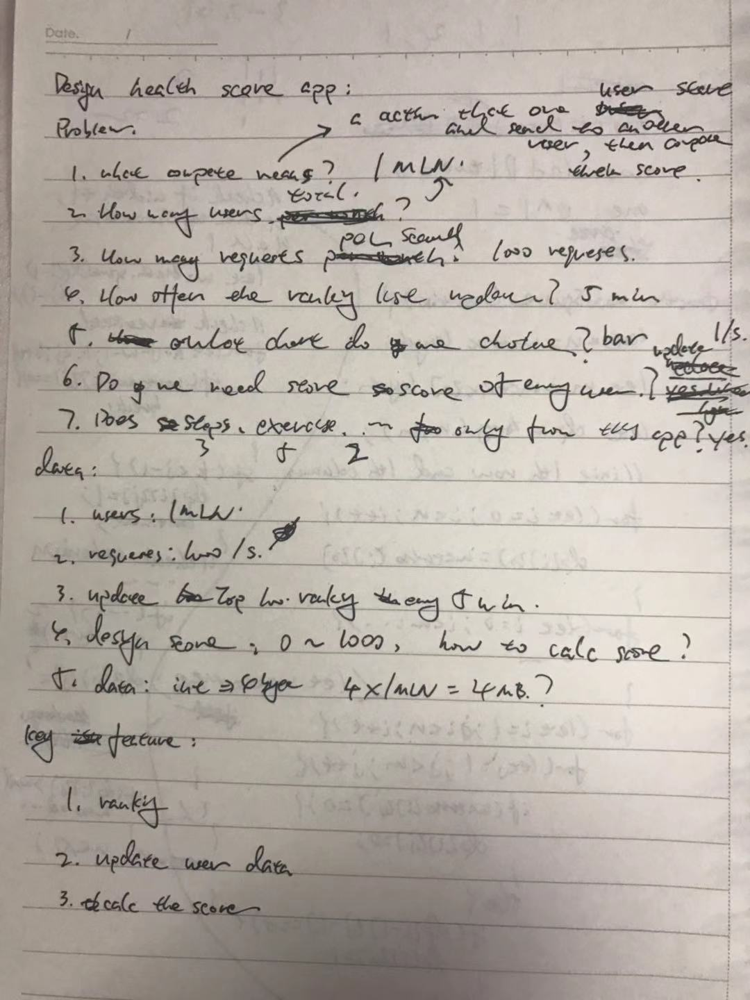
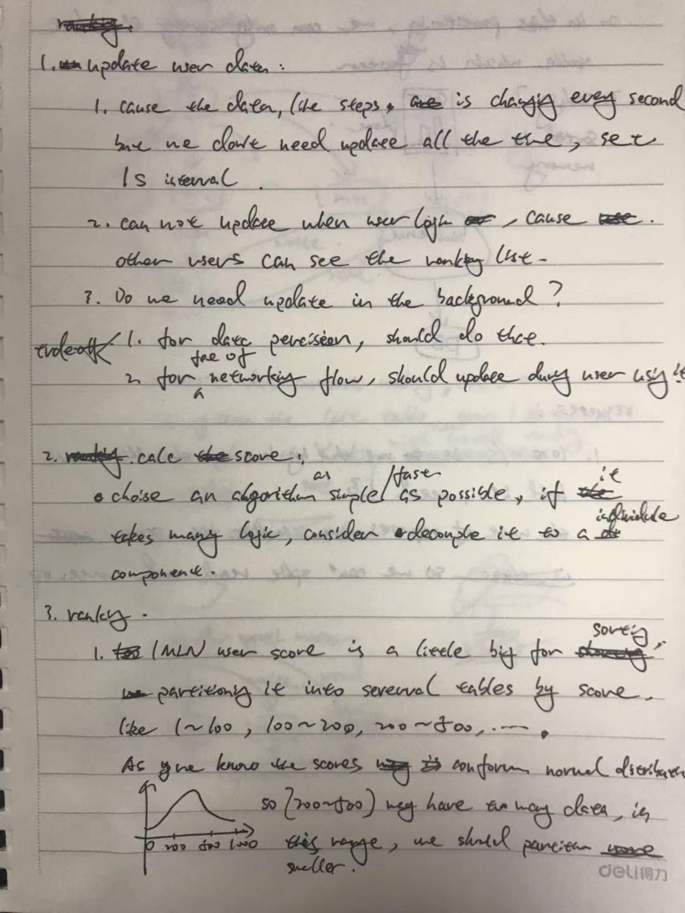
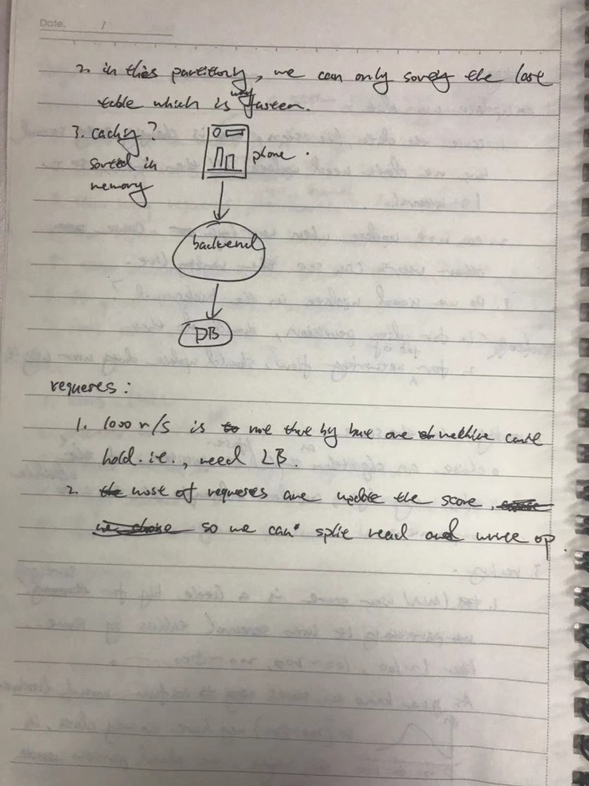
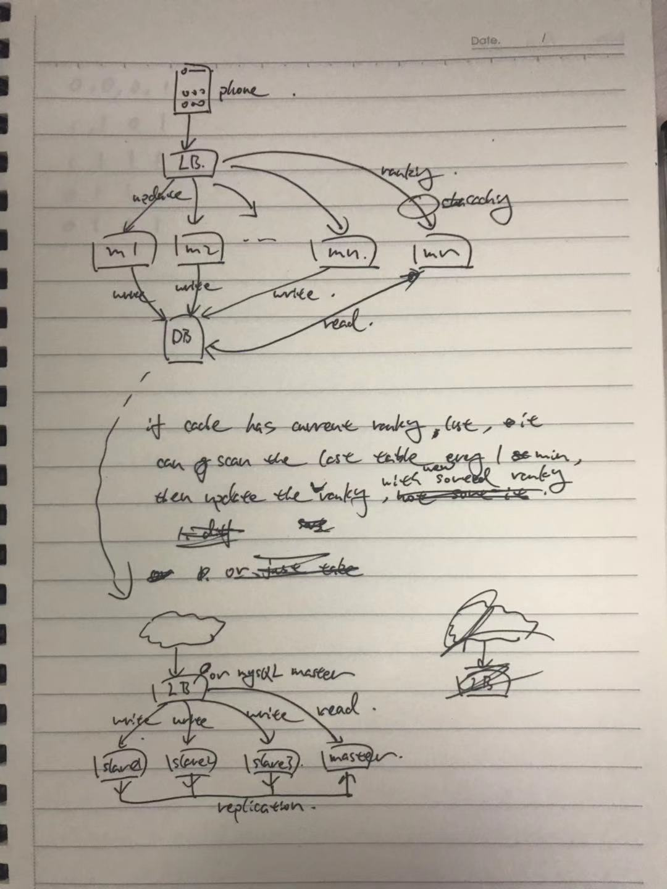
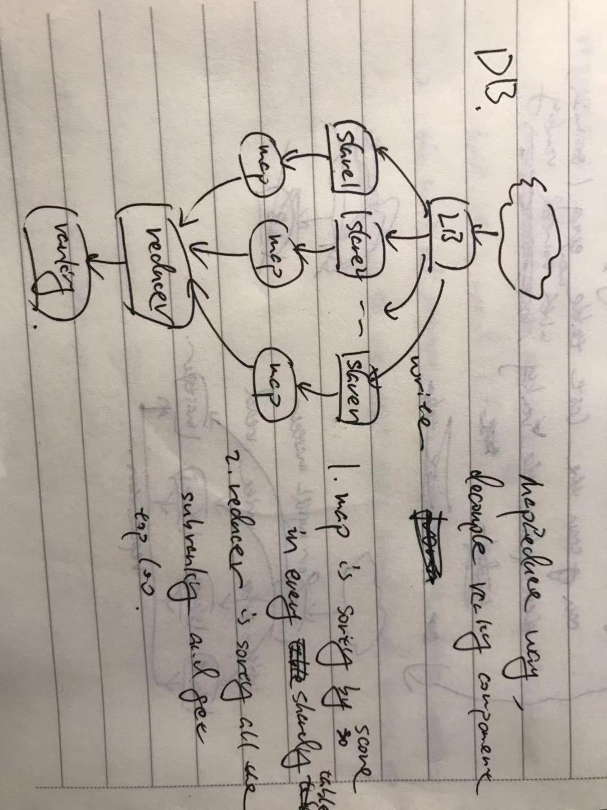

# Amazon | System Design for health score app

People can compete with each other.
Display chart which shows score of top hundres people.

Score can be calculated based on steps, exercise, calories burned.

[link](https://leetcode.com/discuss/interview-question/system-design/366754/Amazon-or-System-Design-for-health-score-app)

## solution

1. Problems

2. key actions

3. main component

4. key issue
    1. if score of an item changed and belong to other table, should move it, which is very redundant

5. resolve it

using **mapReduce** to do ranking. each map sort one table and get top 100, then reducer merge them and get the final top 100