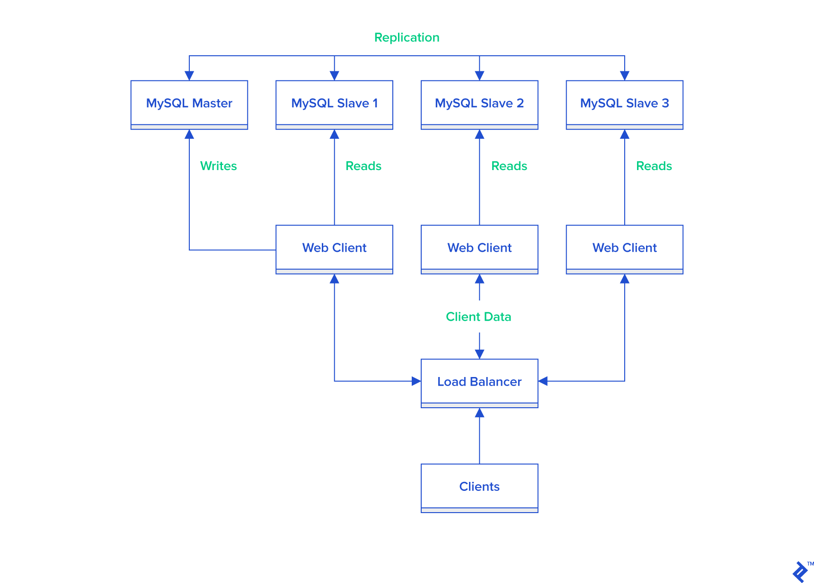
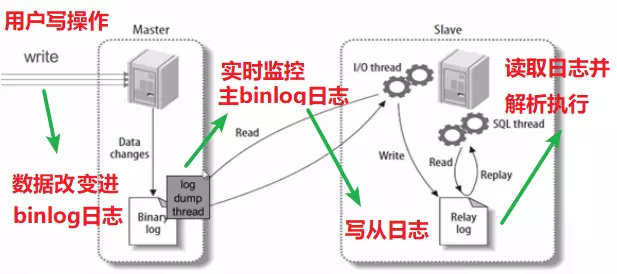

## DB

### Partitioning

split a database into several parts and put them into different server/node(horizontal partitioning)

or split one table into many tables but with same schema(vertical partitioning)

In most cases, horizontal and vertical partitioning are mixed used.

**pros**: 

1. data operation(write/read) will be much faster cause you need only search in a smaller table or db
2. comparing with storing all the data into one place, you can use smaller and cheaper machine to store these data
3. safer to split data into many places rather than into one place

**cons**:

1. if need aggregation, querying will be way slower than in one table, cause there're many tables may all store the data you need

#### difference between partitioning and shading:

> “sharding is distribution or partition of data across multiple different machines whereas partitioning is distribution of data on the same machine”.

from: [https://www.quora.com/Whats-the-difference-between-sharding-DB-tables-and-partitioning-them](https://www.quora.com/Whats-the-difference-between-sharding-DB-tables-and-partitioning-them)

#### Partitioning by business

in this case, I only used horizontal partitioning, which is spliting app to serveral nodes by business (restful). It also can be in one machine for starting, which is vertical partitioning, horizontal partitioning when business become larger

**pros**

1. it's a logical way to split code, and easy to management, just like micro service
2. other pros just like it is said above

**cons**

1. join issue

    we cannot join tables cause they maybe in different db.

    *solution:* join it in app layer, request several SQLs and join the results
2. transaction

    like cons `1`

#### split table

there are two way to split a table:

1. **horizontal way** split items by row, every sub table has the entire schema
2. **vertical way** split a table by column, each sub table only has part of  original schema 

after spliting table, it got a real problem: `how do we know one item in which table?`

it is **the route issue**, and there are 3 ways to solve this problem:

1. `range` 1-10000 into table `1`, 100001-200001 into table `2` ...
    1. **pros** number of tables can grow by data. need only `one` table in the begining
    2. **cons** data is not evenly distributed into tables, it always filled one table, then filled another
2. `hash`  hash id or some other unique attrs which indentify an item, and get a number represents a table or a machine/node 
    1. **pros** data will be distributed evenly into tables.
    2. **cons** it's not easy to scale, may need recalculate hash of every item and put them into new tables when need add new tables
3. `routing list` it's a independent table for routing items, like a hashmap
    1. **pros** solve cons above
    2. **cons**
        1. need an extra query
        2. it may become the bottleneck of the whole system

#### summary issues after partitioning

it's hard to do something which is easy like `join` when all data in one table, but now in different places after partitioning

1. join operation

    **solution:** join it in app layer, request several SQLs and join the results
2. count operation

    **solution:** 
    1. count in app layer. it's inefficient
    2. create a new table to counting. it's efficient but difficult to implement
    3. map reduce?
3. orderby operation
    
    **solution**: orderby in every table, and then merge the result. 

4. consistent id => [Twitter的分布式自增ID算法Snowflake](http://blog.sina.com.cn/s/blog_6b7c2e660102vbi2.html)

#### reference

- [1](https://www.cnblogs.com/jshen/p/7682502.html)
- [2](https://yq.aliyun.com/articles/284561?spm=a2c4e.11155472.0.0.72f3626bkDAMPJ)
- [3](https://www.jianshu.com/p/2b75742e9941)
- [4](https://blog.csdn.net/qq_28289405/article/details/80576614)

### MySQL (relational DB)

**pros**:

- widely used and mature
- support `replication` and `load balance` in cluster

replication:

- master/slave replication
    - master is responsible for writing, and replicate new data to slaves
    - slaves are responsible for reading, and sync data from master

    

    [link](https://www.toptal.com/mysql/mysql-master-slave-replication-tutorial)

- master/master replication
    - replication between master and master
    - master is also responsible for reading

    

separate write and read:

very much like master/slave replication:

1. insert/update/delete op by **master**
2. select op by **slave**
3. master replicate data to slave to keep consistence of data

composite indexes:

1. far left prefix rule

**cons**

- predefine schema (table), not easy when need alter some columns. strict table has pros too, the data is solid, but less flexible
- horizontal scaling is difficult, like sharding and partitioning

### postgreSQL

**pros**

1. advance features, suitable for complex query
2. support several readers and writers to op at same time, concurrency without read locks

**cons**

### MongoDB (NoSQL)

**pros**

- No schema, means more flexible. documents in one collection may have different fields.
    - it's good because some data originally not have these field
    - it's bad because the data is unreliable
- horizontal scaling and vertical scaling are all very easy.

    document is standalone, and can be split into anywhere
- very suit for read-heavy application, greate performance for simple read and write application

**cons**

- data may be stale
- update a document may cause many documents update, which is not suit for write-heavy application

## optimization

1. create index
2. separate write with read
3. partitioning and sharding 