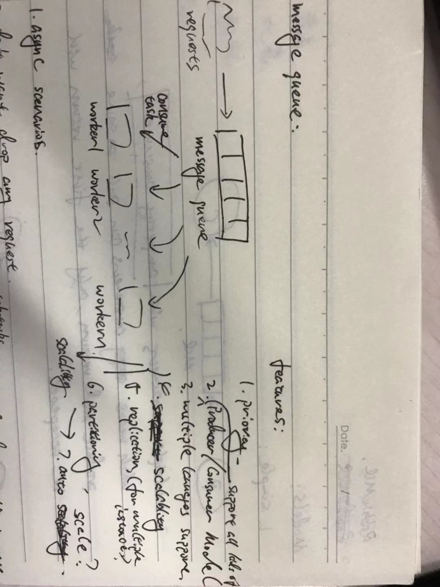
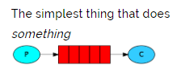
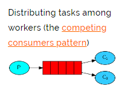
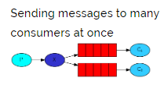

## Message Queue

message queue is kind of **queue** in data structure, but with far more features of course. The main feature I think is decoupling systems and make them into `Producer / Consumer` model.

### features

1. priority
2. Producer / Consumer model
3. multiple lanuage support
4. scalablity
5. replication (for multiple instances)
6. partitioning? if need store messages in drivers
7. auto horizontally scale

### RabbitMQ

[RabbitMQ](https://www.rabbitmq.com/getstarted.html)

1. simple model:

2. multiple consumers model:

3. publish/subscribe model:

