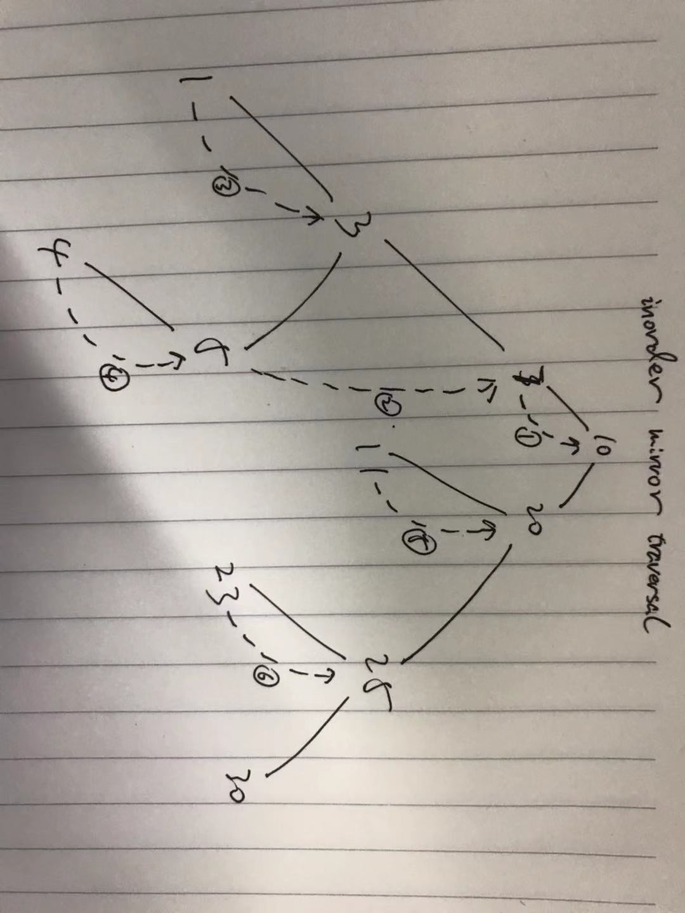

# Tree

# OUTLINE

- way of storage
    - array

        ```js
        let tree = [1, 2, 3, 4, null, 5, 6];
        /**
         *       1
         *     2   3
         *   4    5 6
         */

        function getLeft(i, tree) {
            return tree[2 * i + 1];
        }
        function getRight(i, tree) {
            return tree[2 * i + 2];
        }
        ```
    - pointer(TreeNode)

        ```js
        function TreeNode(val) {
            this.val = val;
            this.left = this.right = null;
        }
        ```
- height

    height of a node is how many levels the path from this node to the deepest leaf node in its sub trees.

    or it can describe in recursive way: height of a node equals max of its left and right subtrees plus 1

    **null node**'s height = -1, **leaf node**'s height = 0

    so get height is the path from current node to its deepest leaf node

    ```js
    // recusive way, post order
    function getHeight(root) {
        if (root == null) {
            return -1;
        }
        let lH = getHeight(root.left);
        let rH = getHeight(root.right);

        return Math.max(lH, rH) + 1;
    }
    // non-recursive way
    function getHeight(root) {
        if (root == null) {
            return -1;
        }
        let stack = new Stack();
        let node = root;
        while (node != null || !stack.isEmpty()) {
            if (node != null) {
                // check itself
                if (
                    (node.left == null || node.left.height != null) &&
                    (node.right == null || node.right.height != null)
                ) {
                    node.height =
                        Math.max(
                            node.left == null ? -1 : node.left.height,
                            node.right == null ? -1 : node.right.height
                        ) + 1;
                    node = null;
                }
                else if (node.left != null && node.left.height == null) {
                    stack.push(node);
                    node = node.left;
                } else if (node.right != null && node.right.height ==) {
                    stack.push(node);
                    node = node.right;
                } 
                // leaf node
                else {
                    node.height = 0;
                    node = null;
                }
            }
            else {
                node = stack.pop();
            }
        }

        return root.height;
    }
    ```

- depth
    
    depth is how many levels one node traverses up to root passing through. Unlike height, depth is counting from one node up to root

- predecessor
    1. predecessor is **the previous node** in **specific order**(inorder, preorder or postorder)
    2. in different traversal, predecessor is different

- successor 
    1. successor is **the next node** in **specific order**(inorder, preorder or postorder)
    2. in different traversal, successor is different

- degree

    it's branch number of a node, e.g. in binary tree, every node at most has **two degree**
- type
    - binary tree
        - binary search tree(BST)
        - AVL Tree
        - Splay Tree
        - Red Black Tree
    - B Tree
    - B+ Tree
- traversal (recursive way and non-recursive way)
    - preorder
        
        first visit root, then its left tree, then its right tree
    - inorder

        first visit left, then root, then right
    - postorder

        first visit left, then right, then root

        1. recursive way
            in these three traversal, recursive way is very easy, e.g.

            ```js
            // preorder
            function preorder(root) {
                // do something with root
                console.log(root.val);
                preorder(root.left);
                preorder(root.right);
            }
            ```
        2. non-recursive way
            using stack, remember the stop condition: `while (node != null || !stack.isEmpty())`
    - levelorder

        like BFS, using Queue, stop condition: `while (!queue.isEmpty())`
    - mirror traversal `this is a very interesting method`

        **mirror traversal** makes S(n) from O(n) to O(1), eliminate `stack`
        
        `/data_structure/tree_ts/problem/mirrorInorderBinaryTree.ts`

        

        1. find the **predecessor** of current node, in inorder, it's:

            ```js
                let predecessor = root.left;
                while (predecessor.right && predecessor.right !== root) {
                    predecessor = predecessor.right;
                }
            ```
        2. **predecessor** in inorder has no right child

            and **predecessor** is the **previous** node of current one in inorder, so when predecessor is visited, instead of **poping stack**, in mirror traversal we just jump to its right, which is a link to the next node. 

            In this way, we save a stack to store previous node by using empty right child
- formula
    - height of full binary tree

        if has `n` nodes, then n = 1 + 2 + 2^2 + ... + 2^(h-1) => `h = logn`
    - degree of tree = number of nodes - 1, etc d = n - 1

        root has no parent, so there is one degree left
    - the min height of a **m-nary** tree with **n** nodes is ceil(logm(n(m - 1)) + 1)

        only if the tree is full, the height of tree is minimum, so:

        n = (m^h - 1) / (m - 1) => ceil(logm(n(m - 1)) + 1)

## Problem summary

postorder:

- getHeight `./tree_ts/problems/getHeight`
- isBalance `./tree_ts/problems/isBalance`

inorder:

- `#99 in leetcode`

preorder:

- `#100`
- `#101`

## tricks

1. **mirror traversal** makes S(n) from O(n) to O(1), eliminate `stack`
2. inorder traversal in a BST will get a sorted array
3. with inorder and preorder array, we can build the tree

    **preorder** offers **root**, inorder offers **left and right** tree nodes