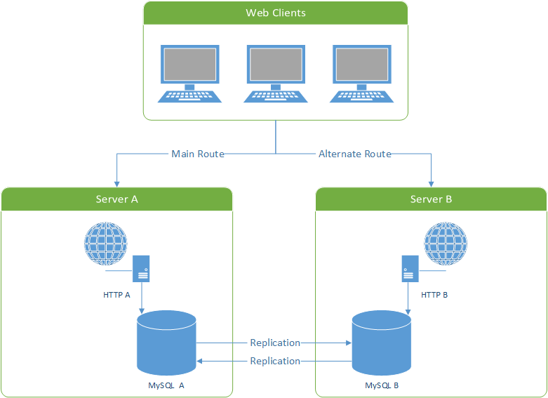

## DB

- shading
    
    one way of partitioning, also named horizontal partitioning, which is spliting a table or rows in a table into several servers

- partitioning
- NoSQL

### MySQL

- widely used
- mature
- clear scaling paradigm
- sharding

replication:

- master/slave replication
    - master is responsible for writing, and replicate new data to slaves
    - slaves are responsible for reading, and sync data from master

    

    [link](https://www.toptal.com/mysql/mysql-master-slave-replication-tutorial)

- master/master replication
    - replication between master and master
    - master is also responsible for reading

    