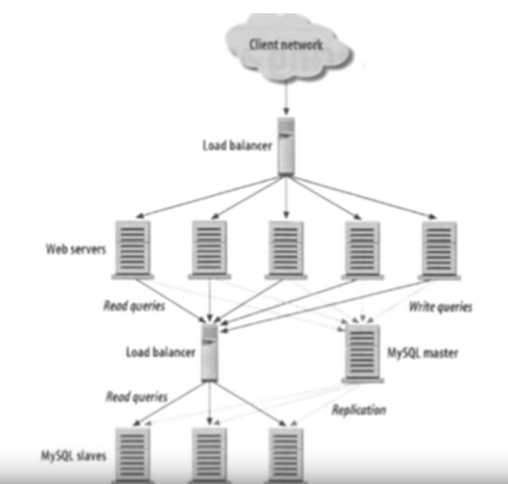

# system design

## Concepts 

- caching
- mapReduce
- load balancer
- distributed system
- database
    - transaction & atomicity
    - replication, to make data from different machines same at time
    - partitioning 
- process && thread && lock
- Nosql
- consistent hashing
- networking
- vertical scaling vs horizontal scaling
    - vertical means add resources in one machine, like hard drive, RAM, CPU
    - horizontal means add more same type of machines

## steps to solve

1. try some user cases first of the system you will design, just pretend you are using it. it's a good way to understand deeply and quickly the system
2. scope the problem or the system, ask anything you are concerning, and trying to small this problem.
3. record these restriction, turn to assumptions
4. try design a non-scalable system first
5. analyze key issues and bottlenecks of the naive one
6. up to large scale, optimize the naive one
    - load test, also means stress test

## when we talk about a technology in scalablity

1. is it mature or new
2. what its features are, and what it masters at
3. what its alternatives

## tricks

1. knowning **the common scale** of some kind of data, e.g. a regular URL takes 100byte, some like that. That is very useful for estimating the scale of data you'll handle
    1. 2/8 law for estimating metrics
2. in relational db, we can create connective tables to connect 2 or more tables, like `user` with `tweet`, cause it's relationship is **many-to-many**
## some common ops

1. how to encrypt/decrypt important infos?

## common metrics of large system

- VPS read/write speed
    - SSD, 200MB/s
    - HHD, 60MB/s
- TTL (time to live), 8bit in ipv4, means how many computers/routers a IP packet can pass through. 
    - `max` 255
    - `recommended` 64
- QPS (query per second)
    - QPS = (1 / t) * n, n is how many requests a sever can handle, t is how long the server can finish a request
    - **400** is a average number of a server right now can handle
- TPS (throughput) how many requests a system can handle per second

## common bottlenecks in scalable system

- network traffic
- a lot of users (requests?)
- a lot of data (how to store and retrieve)

## how to learn a new technology

1. what the problems it solved?
2. what its alternatives are?
3. what some common pros and cons are may be?
4. what common usage scenarios are?

## technologies

- db => `./db.md`

## typical cases

1. read and write heavy application architecture

## weakness

- lack of general knowledges of large system, how many data, some like that
- lack of knowing enough popular techs or concepts in the backend, those are useful in high-level design